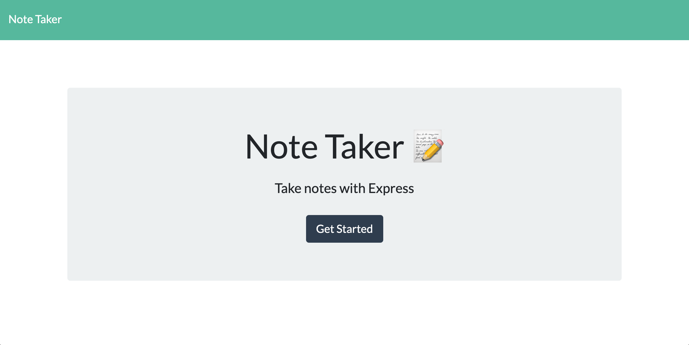
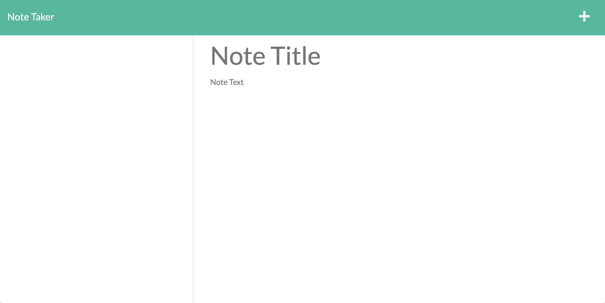

# Note-Taker

## Description
An application called Note Taker that can be used to write and save notes. This application will use an Express.js back end and will save and retrieve note data from a JSON file.

## Table of Contents
- [Screenshots](#screenshots)
- [Links](#links)
- [Contact](#contact)

## Screenshots

[Back to top](#note-taker)

## Links
- 

[Back to top](#note-taker)

## Contact

- Feel free to [email](mailto:k.drummond528@gmail.com) me if you have any questions or comments.

- Check out my [GitHub](https://github.com/kdrummond528).

- Connect with me on [LinkedIn](https://www.linkedin.com/in/karinadrummond).

- View my [portfolio](https://kdrummond528.github.io/Personal-Portfolio/).

[Back to top](#note-taker)